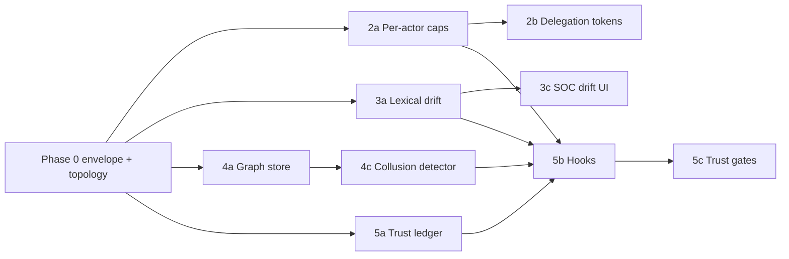

# Implementation plan: capabilities **#2–#5**

This plan turns the multi-agent ideas in [`Multi-Agent-Security.md`](./Multi-Agent-Security.md) into **ordered phases**, shared foundations, and **acceptance criteria**. It assumes **#1 (ingest actor gate)** and the existing **inspect → policy → audit** path stay the spine.

---

## Goals and non-goals

**Goals**

- **#2 Delegation:** Detect when an action is attributed to actor *B* but the **capability context** (or delegation chain) shows only actor *A* could have “asked for” it — classic capability laundering.
- **#3 Goal drift:** Surface a **numeric drift signal** (goal ↔ current action / tool intent) and optionally **policy BLOCK** when drift crosses a threshold.
- **#4 Collusion:** Detect **multi-hop patterns** inside a session (and optionally across sessions) where benign-looking steps combine into exfiltration (e.g. secret-bearing step → different actor → egress tool).
- **#5 Trust score:** Maintain a **decaying numeric trust** per `(sessionId, actor)` (or global actor if you prefer) driven by violations, blocks, and risky domains; **auto-quarantine** or hard cap when trust is low.

**Non-goals (for v2.0 of this plan)**

- Cryptographic **message signing** for every A2A frame (that is **#6** / extension of **#1**).
- Full **taint engine** (**#7**) — collusion and delegation are easier if taint exists later; this plan only **notes** optional hand-offs.

---

## Phase 0 — Shared foundation (blocking for 2–5)

Without a common envelope, each feature becomes bespoke glue.

| Work item | Purpose |
|-----------|---------|
| **P0.1 Message envelope** | Extend `POST /api/v1/events` payload (and/or `InspectionInput`) with optional: `parentEventId`, `capabilityContext` (set of tool names the sender asserts), `delegationChain` (ordered list of `{fromActor, toActor, scope}` or opaque capability id). Version with `schemaVersion`. |
| **P0.2 Session topology** | Persist `registeredActors[]` + default **`actorCapabilities`** map on `Session` (or side table `session_actor_caps`). Seed from tenant defaults; optional override on `POST /sessions`. |
| **P0.3 Ingest validation order** | After **#1** allow-list: parse envelope → normalize actors → pass into inspect side-channel (thread-local or explicit DTO) so L* scanners and policy see the same view. |
| **P0.4 Audit / threat taxonomy** | Reserve stable categories: `CAPABILITY_ESCALATION`, `GOAL_DRIFT`, `AGENT_COLLUSION`, `TRUST_THRESHOLD` (names TBD) for metrics + Policy Lab replay. |

**Exit criteria:** One LangGraph path emits **enriched** `tool_call` ingest events; backend stores caps per actor; a single integration test proves unknown fields are ignored safely (backward compatible).

---

## #2 — Capability delegation / laundering

### Concept

- Each **actor** has an allowed tool set (subset of session caps).
- A **delegation** is only valid if `delegationChain` contains a **proof** the mesh understands: for v2.0 minimal, a **server-issued delegation token** (short TTL, stored in Redis/Postgres) issued when actor A explicitly requests “run `email.send` as B” through a **new REST endpoint**; for v2.1, OCap-style attenuated references.

### Phases

| Phase | Scope | Deliverables |
|-------|--------|--------------|
| **2a** | **Static caps** | `session_actor_caps(actor, jsonb tools)` + enforcement in **L6 extension** or new **L6b** scanner: `tool ∉ union(sender_caps, delegated_caps)` → `over_capability` evidence + policy flag `capability_escalation`. |
| **2b** | **Synthetic delegation demo** | Endpoint `POST /api/v1/sessions/{id}/delegations` mints JWT-like opaque id bound to `{from, to, tools[], exp}`. Ingest includes `delegationId`; backend validates. |
| **2c** | **Policy + SOC** | YAML rules on `capability_escalation`; drawer shows **which actor** exceeded **which** delegated scope. |

**Tests:** Unit: delegation expired / wrong actor / tool not in grant. IT: planner ingest without delegation cannot attribute `email.send` to planner if only executor may send.

**Cut line:** Ship **2a** for demo credibility before **2b** crypto UX.

---

## #3 — Goal drift detection

### Concept

- Session has `goal` (already).
- On each **outbound inspect**, compute `driftScore ∈ [0,1]` = *low* means aligned with goal, *high* means off-mission.

### Phases

| Phase | Scope | Deliverables |
|-------|--------|--------------|
| **3a** | **Cheap lexical score** | Token overlap / cosine on bag-of-words between `goal` and `tool + canonical(args)` string. Fast, no new infra. Expose in audit payload `goal_drift_score`. |
| **3b** | **Embedding score** | Optional: call existing LLM/embed endpoint or local small model; cache per session step. |
| **3c** | **SOC graph** | Sparkline in drawer or ReasoningGraph overlay: last N drift values; threshold line. |
| **3d** | **Policy** | `goal_drift_score > 0.72` → REQUIRE_APPROVAL or BLOCK depending on bundle. |

**Tests:** Golden vectors (“book hotel…” + `payments.charge` → high drift). Property: drift monotonic with injected irrelevant tool sequence.

**Cut line:** **3a + 3d** is enough for judges; **3b** if lexical false negatives hurt demos.

---

## #4 — Agent collusion detection

### Concept

- Build a **directed graph** per session: nodes = `(actor, eventId)` or simplified `(actor, stepIndex)`; edges = `parentEventId` / ordering.
- **Patterns** (rule-based v1): (1) secret signal from DLP on inbound → within K steps outbound `email.send`/`http.*` by **different** actor; (2) alternating low-risk tools then single egress spike; (3) same `contentHash` seen in tool_result from A later in args of B.

### Phases

| Phase | Scope | Deliverables |
|-------|--------|--------------|
| **4a** | **Graph store** | In-memory `ConcurrentHashMap<SessionId, Graph>` + periodic trim OR Postgres `session_edges` table (session_id, src_event, dst_event, edge_type). |
| **4b** | **Feature extractors** | Subscribe to existing events + inspect outcomes; tag nodes with `has_secret`, `is_egress`. |
| **4c** | **Detector** | `CollusionScanner` (or post-inspect hook): emit `AGENT_COLLUSION` threat with evidence path **A→B→tool**. |
| **4d** | **Cross-session (optional)** | Same `contentHash` / tenant across sessions within 24h — expensive; flag as v3. |

**Tests:** Scripted two-actor sequence that is benign alone; second actor exfil → must fire. False-positive budget: tune K and require DLP secret flag.

**Dependency:** **P0.1** parent links; **#7 taint** would sharpen **4b** but is not required for a first collusion demo.

---

## #5 — Trust score per actor

### Concept

- `trust(sessionId, actor) ∈ [0,100]` starts at **100**.
- **Decrements** on: BLOCK/QUARANTINE, `AGENT_IDENTITY_VIOLATION`, `CAPABILITY_ESCALATION`, `GOAL_DRIFT` breach, `AGENT_COLLUSION`, high L7 match, repeated risky domains (reuse L5 signals).
- **Half-life decay** toward 100 (forgiveness) every N minutes or per event.

### Phases

| Phase | Scope | Deliverables |
|-------|--------|--------------|
| **5a** | **Ledger** | `session_actor_trust(session_id, actor, score, updated_at)` or Redis sorted set for hot path. |
| **5b** | **Hooks** | After each inspect / threat: `TrustLedger.adjust(session, actor, delta, reason)`. |
| **5c** | **Gates** | If `trust < 40` → force BLOCK for further outbound except `browser.goto` to allowlist / or full session quarantine (align with product). |
| **5d** | **SOC** | Small table on Tenants or Session drawer: **Planner 92 · Executor 71**. |

**Tests:** Deterministic sequence of violations drops score; decay raises it; gate blocks at threshold.

**Dependency:** Strongly synergizes with **#2–#4** (they become **inputs** to trust deltas). Can ship **5a–5b** with manual decrements first, then wire scanners.

---

## Recommended sequence (dependency-aware)

**Suggested milestones**

1. **M1 (demo-ready “mesh brain”):** P0 + **2a** + **3a** + audit/policy fields.  
2. **M2 (demo narrative):** **4a–4c** + SOC path visualization.  
3. **M3 (governance):** **5a–5c** + **2b** if you need a non-handwavy delegation story.  
4. **M4 (polish):** **3b–3c**, cross-session **4d**, fine-tuned trust decay.

---

## Risks and mitigations

| Risk | Mitigation |
|------|------------|
| **Envelope sprawl** | `schemaVersion` + ignore unknown fields; strict validation only on new clients. |
| **False positives** (drift / collusion) | Start in **WARN** / policy `REQUIRE_APPROVAL`; promote to BLOCK after field tuning. |
| **Hot-path latency** | Drift lexical in &lt;1ms; graph updates async after inspect response; trust updates batched. |
| **Multi-tenant isolation** | All new tables keyed by `tenant_id` + `session_id`; no cross-tenant graph edges in v1. |

---

## Where to track execution

- Link this file from [`Multi-Agent-Security.md`](./Multi-Agent-Security.md) (roadmap table).  
- When work starts, create GitHub issues **per phase** (P0.1, 2a, 3a, …) with the **exit criteria** copied into the issue body.

---

## Summary

| # | First shippable slice | Depends on |
|---|------------------------|------------|
| **2** | Per-actor tool caps + L6/policy `capability_escalation` | P0 topology |
| **3** | Lexical drift score in audit + policy threshold | Session `goal` (exists) |
| **4** | Session event graph + simple two-actor exfil pattern | P0 `parentEventId`, DLP signals |
| **5** | Trust ledger + decrements + threshold gate | Threat / inspect hooks; best after 2–4 signals exist |

This keeps each milestone **testable** and avoids painting the SOC into a corner with fake graphs.
